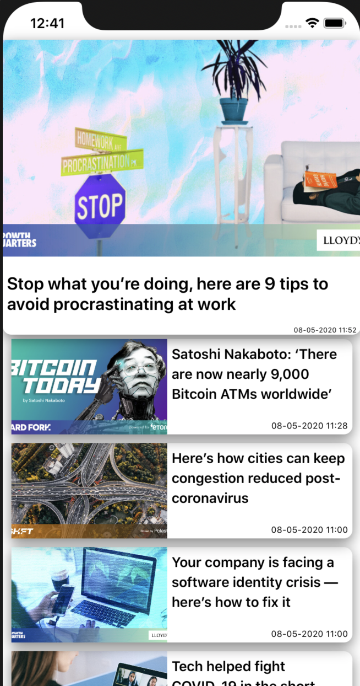

# NewsApp

Single-view application which displays list of news from `newsapi.org`.
When application runs, user see screen with news for last 24 hours only.
When user reaches the end of current news list, then next news page for previous day downloaded and added to the bottom etc. till list contains 7-days news.
User  able to refresh news list by pull-to-refresh.
Search bar allow user to filter currently downloaded news by news title(User can find it at top of main screen).

## Setup

- Clone the repo: `git clone https://github.com/BunosJenia/NewsApp.git`
- Install with Pods: `pod install`
- Add APIKey from  `newsapi.org` to  `/NewsApp/Resources/Settings.swift`

## ScreenShoots

> Main Page


> Search Functionality


> Pull To Refresh


## Notes

- Used  `NSCache` for caching Images.
- Used  `lottie-ios POD` for Loading Spinner.
- `UILabel Extension`  downloaded from the Internet.
- Saving data from API to CoreData was not implemented(maybe will do it in future), but made a template for it.
- Made template for TableHeader, but faced with some issues so didn't finish with it.
- Didn't implement single NewsArticle Page.
- If no Image provided standard image will be added.


If you want to use  `HeaderView` you should:
- add `var headerView: HeaderView?` to `AppController` 
- update `addHeader` method in `AppController` :

```
func addHeader(article: NewsArticle) {
    if self.dayCount == 0 {
        self.headerView = HeaderView(frame: self.tableView.frame, article: article)
    }
}
```
 
 And it will Look like:
 
 

